# RESTFul API Bank

## Descrição do projeto

Este projeto tem como objetivo a construção das seguintes funcionalidades através de endpoints:

-   Criar conta bancária
-   Listar contas bancárias
-   Atualizar os dados do usuário da conta bancária
-   Excluir uma conta bancária
-   Depósitar em uma conta bancária
-   Sacar de uma conta bancária
-   Transferir valores entre contas bancárias
-   Consultar saldo da conta bancária
-   Emitir extrato bancário

## Pré-requisitos para rodar o projeto

Será necessário que você tenha instalado em sua máquina as ferramentas [Git](https://git-scm.com), [Node.js](https://nodejs.org/en/), um ambiente de editor de código tal qual o [VSCode](https://code.visualstudio.com/), e um ambiente para acessar as endpoints, enviar e receber requisições JSON, o [Nodemon](https://www.npmjs.com/package/nodemon).


## 🎲 Rodando o servidor

```bash

# Clone este repositório

# Acesse a pasta do projeto no terminal/cmd e instale as dependências
$ npm init -y
$ npm install express
$ npm install date-fns --save
$ npm install -D nodemon

#Na pasta package.json, em scripts, mude seu conteudo para "dev": "nodemon ./src/index.js"

#Assim, para iniciar o servidor, utilize o comando:
$ npm run dev

# O servidor inciará na porta:3000 - acesse http://localhost:3000 no Insomnia

```

## Persistências dos dados

Os dados serão persistidos em memória, no objeto existente dentro do arquivo `bancodedados.js`. Todas as transações e contas bancárias estarão inseridas dentro deste objeto, seguindo a estrutura que já existe.

### Estrutura do objeto no arquivo `bancodedados.js`

```javascript
{
    banco: {
        nome: "Cubos Bank",
        numero: "123",
        agencia: "0001",
        senha: "Cubos123Bank",
    },
    contas: [
        // array de contas bancárias
    ],
    saques: [
        // array de saques
    ],
    depositos: [
        // array de depósitos
    ],
    transferencias: [
        // array de transferências
    ],
}
```
## Estrutura da API

Essa API é dividida da seguinte forma:

-   Uma pasta `src` que contém arquivos/pasta, como:
    - Pasta `controladores`
        - arquivo `controladores.js`
    - arquivo `bancodedados.js`
    - arquivo `index.js`
    - arquivo `rotas.js`
-   Arquivo `.gitignore`

## Como testar

### Criar conta bancária

#### `POST` `/contas`

Esse endpoint cria uma conta bancária, onde será gerado um número único para identificação da conta (número da conta).

-   **Requisição** - O corpo (body) deverá possuir um objeto com as seguintes propriedades (respeitando estes nomes):

    -   nome
    -   cpf
    -   data_nascimento
    -   telefone
    -   email
    -   senha

-   **Resposta**
    Em caso de **sucesso**, não envia conteúdo no corpo (body) da resposta.  
    Em caso de **falha na validação**, a resposta possui ***status code*** apropriado, e em seu corpo (body) um objeto com uma propriedade **mensagem** que tem como valor um texto explicando o motivo da falha.  

#### Exemplo de Requisição e Resposta

*Criando uma conta:*
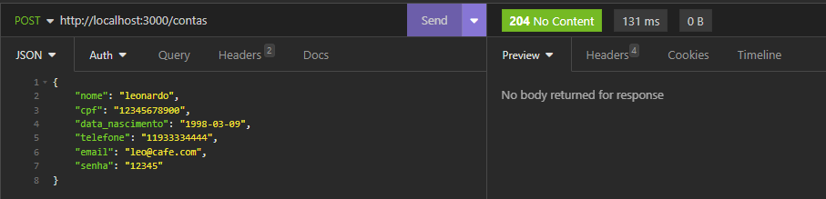

*Tentando criar uma conta com o mesmo CPF:*
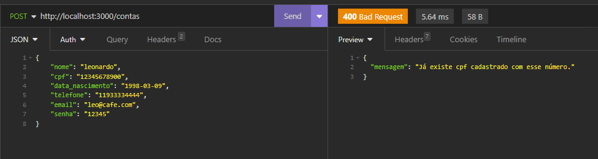

*Tentando criar uma conta com o mesmo Telefone:*


*Tentando criar uma conta com o mesmo Email:*
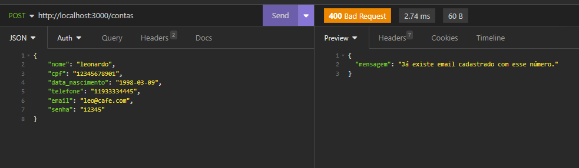

*Tentando criar uma conta sem preencher um campo:*
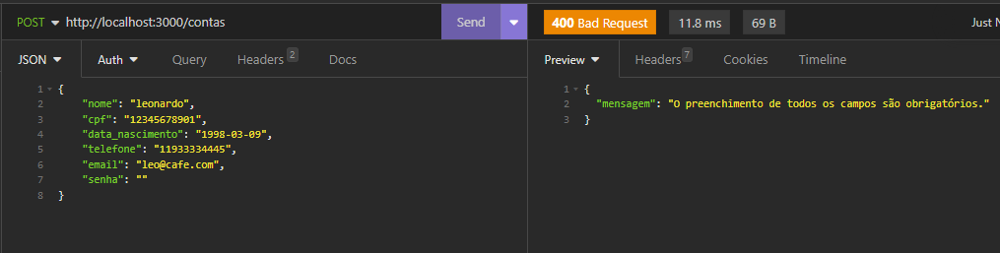

### Listar contas bancárias

#### `GET` `/contas?senha_banco=Cubos123Bank`

Esse endpoint lista todas as contas bancárias existentes.

-   Verifica se a senha do banco foi informada (passado como query params na url)
-   Valida se a senha do banco está correta

#### Exemplo de resposta

*Em caso de sucesso na requisição:*


*Em caso de senha incorreta:*
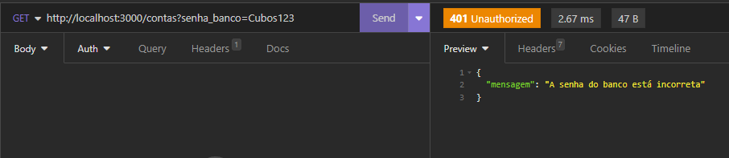

*Em caso de não informar senha, apenas restringe o acesso:*
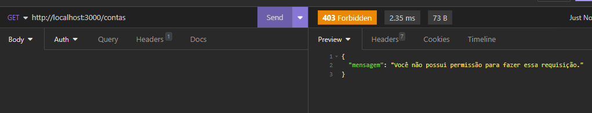

### Atualizar usuário da conta bancária

#### `PUT` `/contas/:numeroConta/usuario`

Esse endpoint atualiza apenas os dados do usuário de uma conta bancária.

-   Verifica se foi passado todos os campos no body da requisição
-   Verifica se o numero da conta passado como parametro na URL é válida
-   Se o CPF for informado, verifica se já existe outro registro com o mesmo CPF
-   Se o E-mail for informado, verifica se já existe outro registro com o mesmo E-mail

-   **Requisição** - O corpo (body) deverá possuir um objeto com todas as seguintes propriedades (respeitando estes nomes):

    -   nome
    -   cpf
    -   data_nascimento
    -   telefone
    -   email
    -   senha

-   **Resposta**

    Em caso de **sucesso**, não envia conteúdo no corpo (body) da resposta.  
    Em caso de **falha na validação**, a resposta possui ***status code*** apropriado, e em seu corpo (body) um objeto com uma propriedade **mensagem** que tem como valor um texto explicando o motivo da falha.  

#### Exemplo de Requisição e Resposta

*Em caso de encontrar um CPF igual já existente:*
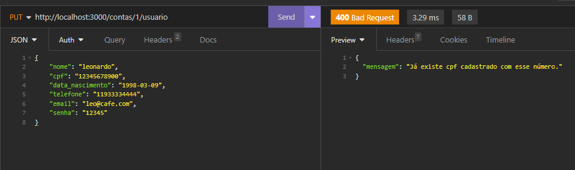

*Em caso de encontrar um telefone igual já existente:*
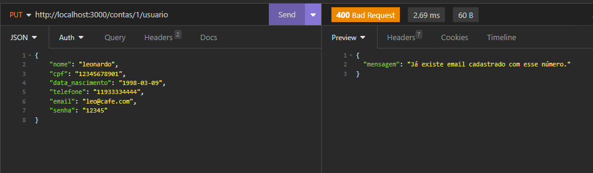

*Em caso de sucesso:*
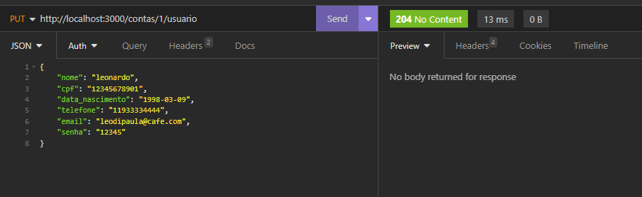

*Em caso de id errado:*
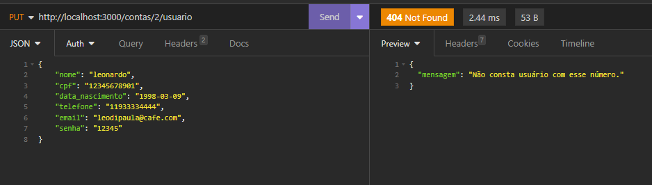

*Em caso de não preencher todos os dados:*
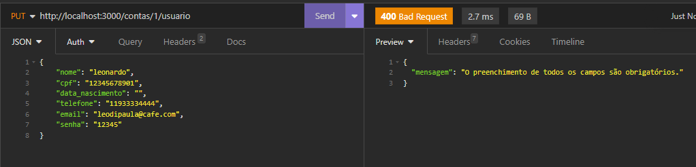
### Excluir Conta

#### `DELETE` `/contas/:numeroConta`

- Esse endpoint exclui uma conta bancária existente.
    -   Verifica se o numero da conta passado como parametro na URL é válido
    -   Permite excluir uma conta bancária apenas se o saldo for 0 (zero)
    -   Remove a conta do objeto de persistência de dados.

-   **Requisição**

    -   Numero da conta bancária (passado como parâmetro na rota)

-   **Resposta**

    Em caso de **sucesso**, não envia conteúdo no corpo (body) da resposta.  
    Em caso de **falha na validação**, a resposta possui ***status code*** apropriado, e em seu corpo (body) um objeto com uma propriedade **mensagem** que tem como valor um texto explicando o motivo da falha.

#### Exemplo de Requisição e Resposta

*Caso que há saldo na conta:*
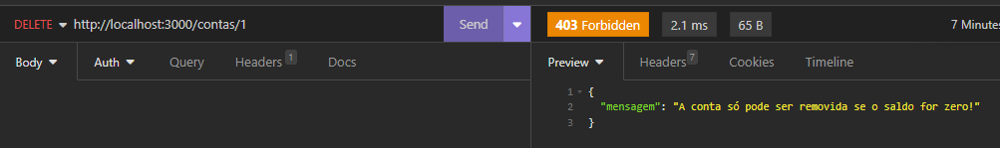

*Conta apagada com sucesso:*

### Depositar

#### `POST` `/transacoes/depositar`

- Esse endpoint soma o valor do depósito ao saldo de uma conta válida e registra essa transação.
    -   Verificar se o numero da conta e o valor do deposito foram informados no body
    -   Verificar se a conta bancária informada existe
    -   Não permitir depósitos com valores negativos ou zerados
    -   Somar o valor de depósito ao saldo da conta encontrada

-   **Requisição** - O corpo (body) deverá possuir um objeto com as seguintes propriedades (respeitando estes nomes):

    -   numero_conta
    -   valor

-   **Resposta**

    Em caso de **sucesso**, não envia conteúdo no corpo (body) da resposta.  
    Em caso de **falha na validação**, a resposta possui ***status code*** apropriado, e em seu corpo (body) um objeto com uma propriedade **mensagem** que tem como valor um texto explicando o motivo da falha.

#### Exemplo de Requisição e Resposta
*Depósito realizado com sucesso:*
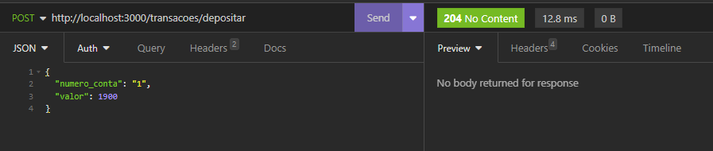

*Conta com id não existente:*


*Tentativa de depósito com valor negativo:*
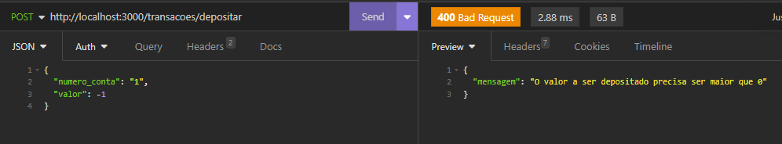

*Body não preenchido completamente:*
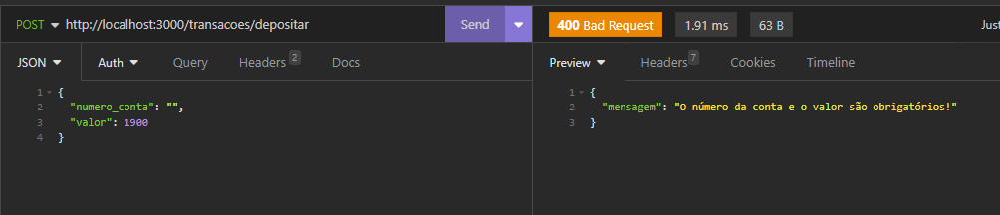

### Sacar

#### `POST` `/transacoes/sacar`

- Esse endpoint realiza o saque de um valor em uma determinada conta bancária e registra a data e hora dessa transação.

    -   Verificar se o numero da conta, o valor do saque e a senha foram informados no body
    -   Verificar se a conta bancária informada existe
    -   Verificar se a senha informada é uma senha válida para a conta informada
    -   Verificar se há saldo disponível para saque
    -   Subtrair o valor sacado do saldo da conta encontrada

-   **Requisição** - O corpo (body) deverá possuir um objeto com as seguintes propriedades (respeitando estes nomes):

    -   numero_conta
    -   valor
    -   senha

-   **Resposta**

    Em caso de **sucesso**, não envia conteúdo no corpo (body) da resposta.  
    Em caso de **falha na validação**, a resposta possui ***status code*** apropriado, e em seu corpo (body) um objeto com uma propriedade **mensagem** que tem como valor um texto explicando o motivo da falha.

#### Exemplo de Requisição e Resposta
*Saque realizado com sucesso:*
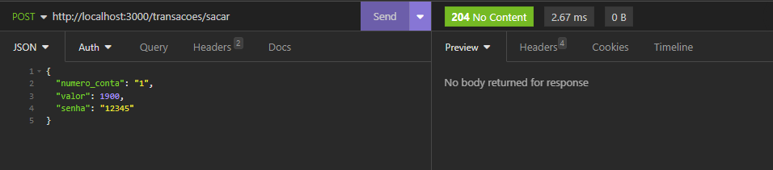

*Tentativa de saque em id que não existe:*
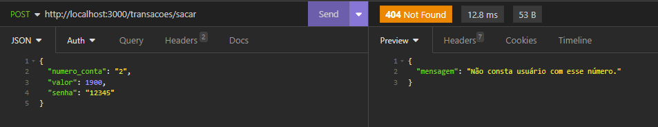

*Tentativa de saque maior que o saldo na conta:*
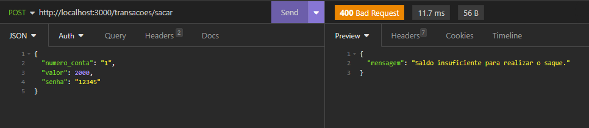

*Senha informada incorreta:*
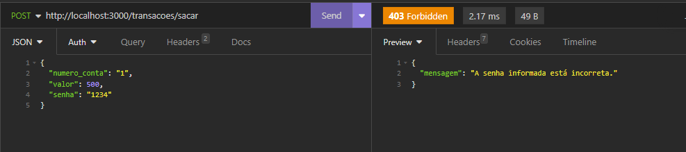

*Body não preenchido completamente:*

### Tranferir

#### `POST` `/transacoes/transferir`

- Esse endpoint deverá permitir a transferência de recursos (dinheiro) de uma conta bancária para outra e registrar essa transação.
    -   Verificar se o número da conta de origem, de destino, senha da conta de origem e valor da transferência foram informados no body
    -   Verificar se a conta bancária de origem informada existe
    -   Verificar se a conta bancária de destino informada existe
    -   Verificar se a senha informada é uma senha válida para a conta de origem informada
    -   Verificar se há saldo disponível na conta de origem para a transferência
    -   Subtrair o valor da transfência do saldo na conta de origem
    -   Somar o valor da transferência no saldo da conta de destino

-   **Requisição** - O corpo (body) deverá possuir um objeto com as seguintes propriedades (respeitando estes nomes):

    -   numero_conta_origem
    -   numero_conta_destino
    -   valor
    -   senha

-   **Resposta**

    Em caso de **sucesso**, não envia conteúdo no corpo (body) da resposta.  
    Em caso de **falha na validação**, a resposta possui ***status code*** apropriado, e em seu corpo (body) um objeto com uma propriedade **mensagem** que tem como valor um texto explicando o motivo da falha.

#### Exemplo de Requisição e Resposta
*Transferência realizada com sucesso:*
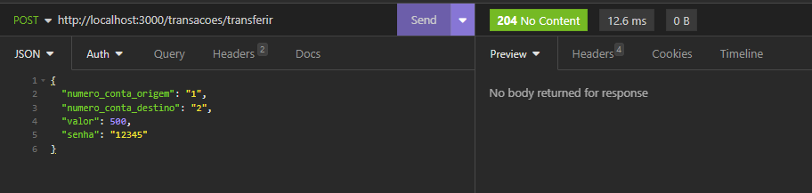

*Caso em que o id da conta de origem ou destino não existe:*
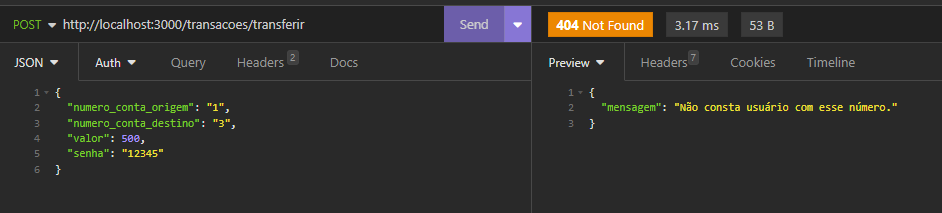

*Caso em que o saldo é insuficiente para transferir:*
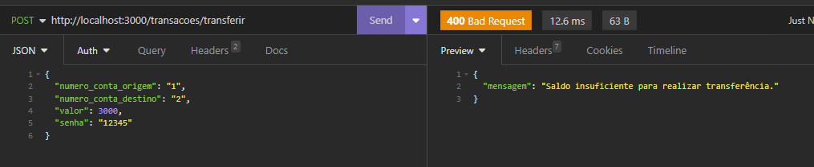

*Caso com senha informada incorreta:*
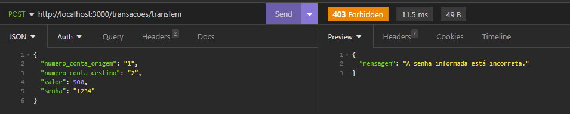

*Caso de body não preenchido:*
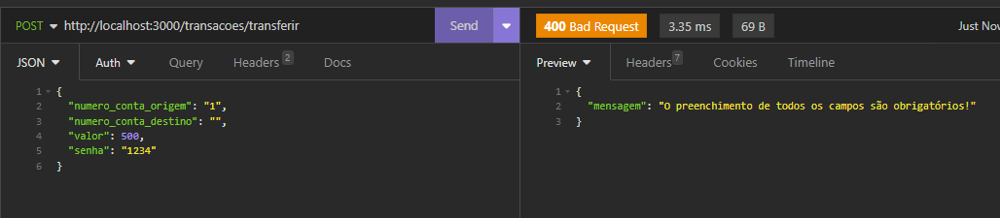

### Saldo

#### `GET` `/contas/saldo?numero_conta=123&senha=123`

- Esse endpoint deverá retornar o saldo de uma conta bancária.
    -   Verifica se o numero da conta e a senha foram informadas (passado como query params na url)
    -   Verifica se a conta bancária informada existe
    -   Verifica se a senha informada é uma senha válida
    -   Exibi o saldo da conta bancária em questão

-   **Requisição** - query params

    -   numero_conta
    -   senha

-   **Resposta**

    -   Saldo da conta

#### Exemplo de Requisição e Resposta

*Saldo consultado com sucesso:*

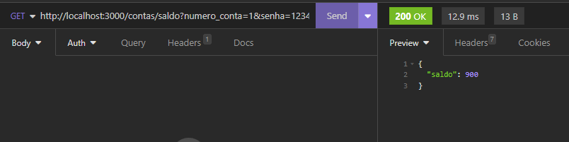

*id não existe:*
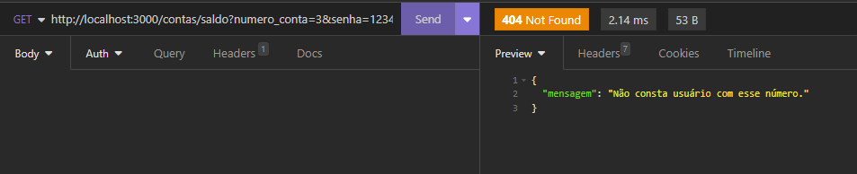

*Senha incorreta:*
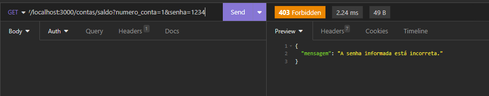

*Saldo ou senha não foram informados:*
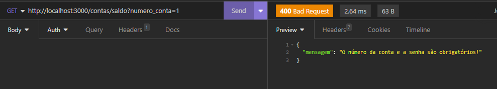

### Extrato

#### `GET` `/contas/extrato?numero_conta=123&senha=123`

- Esse endpoint lista as transações realizadas de uma conta específica.
    -   Verifica se o numero da conta e a senha foram informadas (passado como query params na url)
    -   Verifica se a conta bancária informada existe
    -   Verifica se a senha informada é uma senha válida
    -   Retorna a lista de transferências, depósitos e saques da conta em questão.

-   **Requisição** - query params

    -   numero_conta
    -   senha

-   **Resposta**
    -   Relatório da conta

#### Exemplo de Requisição e Resposta
*Consulta do extrato realizada com sucesso:*
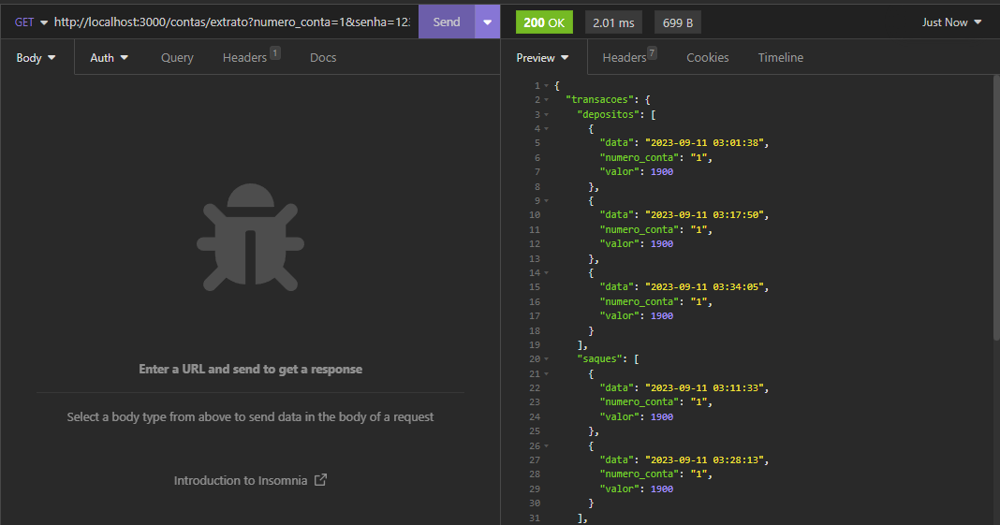
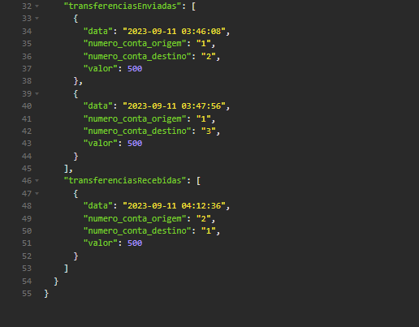

*Não existe conta com id específicado:*
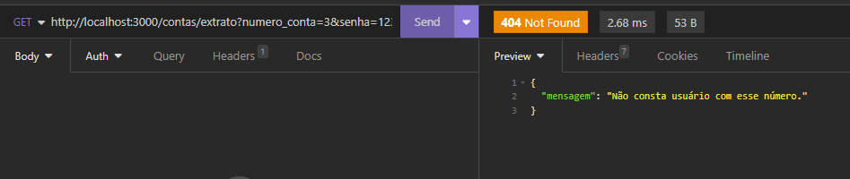

*Senha informada incorreta:*
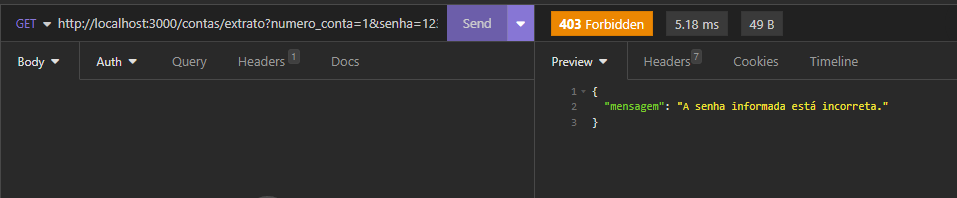

*Senha ou id não informados:*
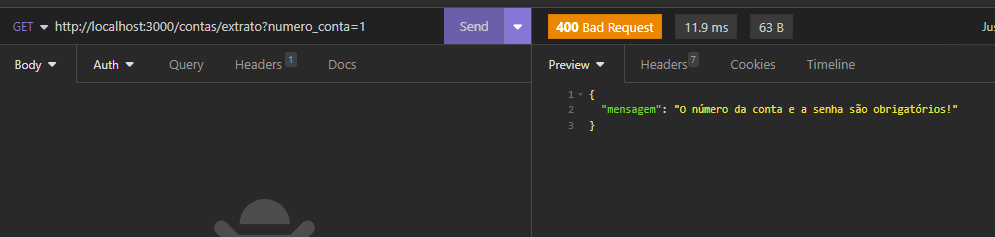